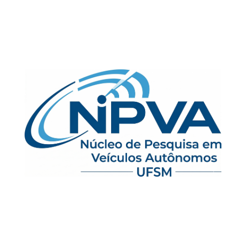

# 🚗 NPVA-UFSM 
**Núcleo de Pesquisa em Veículos Autônomos - Universidade Federal de Santa Maria**


<div align="center">
  
</div>

---

## 📌 Sobre o Núcleo
O **NPVA-UFSM** (Núcleo de Pesquisa em Veículos Autônomos) é um grupo de pesquisa focado no desenvolvimento, simulação e implementação de tecnologias voltadas para a condução autônoma. Sediado na Universidade Federal de Santa Maria (UFSM), nosso objetivo é fomentar a pesquisa acadêmica e a inovação tecnológica no setor de mobilidade e robótica móvel.

## 🎯 Nossos Objetivos
* Desenvolver algoritmos robustos de **Percepção**, **Planejamento** e **Controle**.
* Criar ambientes de simulação realistas para testes de veículos autônomos.
* Implementar soluções de software em hardware real (veículos em escala e em tamanho real).
* Publicar artigos científicos e contribuir para a comunidade open-source.

## 🔬 Linhas de Pesquisa
1.  **Percepção Visual e Sensorial:** Visão computacional, processamento de nuvens de pontos (LiDAR), fusão de sensores e SLAM (Simultaneous Localization and Mapping).
2.  **Planejamento de Trajetória e Navegação:** Algoritmos de roteamento, desvio de obstáculos dinâmicos e tomada de decisão estruturada.
3.  **Controle Veicular:** Controle lateral e longitudinal, cinemática e dinâmica de veículos.
4.  **Inteligência Artificial:** Redes neurais aplicadas ao reconhecimento de placas, semáforos, pedestres e aprendizado por reforço (Reinforcement Learning).

## 🛠️ Tecnologias e Ferramentas Utilizadas
* **Linguagens:** Python, C++, MATLAB.
* **Sistemas Robóticos:** ROS (Robot Operating System), ROS 2.
* **Simulação:** Gazebo, CARLA Simulator, Webots.
* **Bibliotecas e Frameworks:** OpenCV, PyTorch, TensorFlow, PCL (Point Cloud Library).

## 🚀 Como Começar (Getting Started)

Para clonar este repositório e configurar o ambiente de desenvolvimento básico:

### Pré-requisitos
* Ubuntu 20.04 ou 22.04
* ROS Noetic ou ROS 2 Humble (dependendo do subprojeto)
* Python 3.8+

### Instalação
1. Clone o repositório:
   ```bash
   git clone [https://github.com/npva-ufsm/projeto-principal.git](https://github.com/npva-ufsm/projeto-principal.git)
